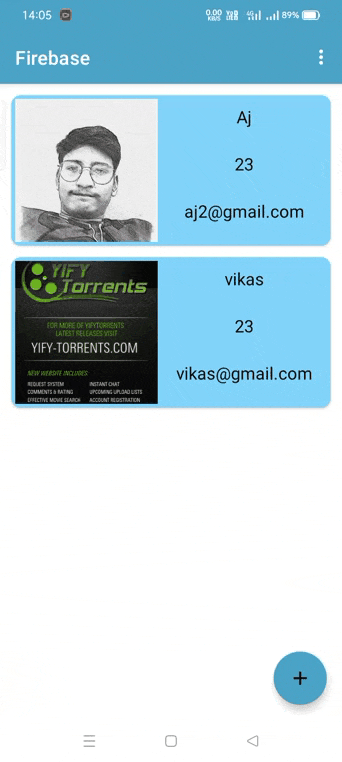
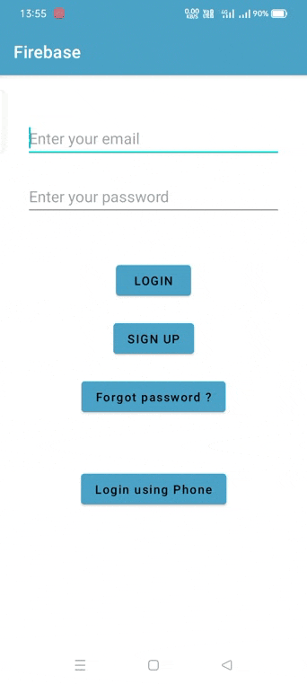
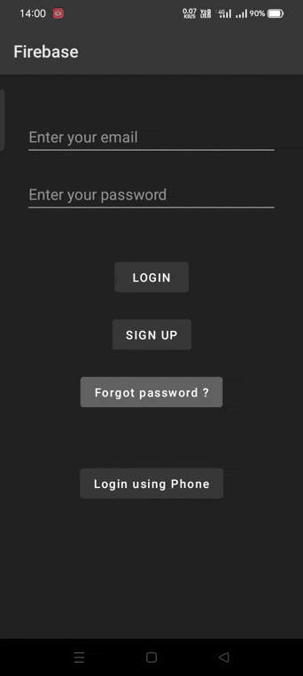

# Share Data App
This app can be used for keeping record of person with their basic details. This app uses Firebase realtime database for CRUD operation and it also has Firebase Authentication feature. It also uses firebase cloud storage to store file such as profile image.
It can be used to add, delete, update and show list of employees, students etc in academic instituion or in any organisation.

### Features :-
- This app has both light and dark theme implemention.
- Has authentication feature - login with Email or Phone
- It has Reset Password option
- Firebase realtime database for CRUD operation
- Firebase cloud storage for storing files.

### Used Library :-
- firbase-auth
- firebase-database
- firebase-firestore
- firebase-storage
- firebase-messaging
- picasso
- firebase-BoM

### Screenshots :-
Below are the screenshots in sequence
###  Add User, Update User, Delete User, Delete All User, Theme Change, Sign Up, Log Out, Log In, Reset Password 

</p
